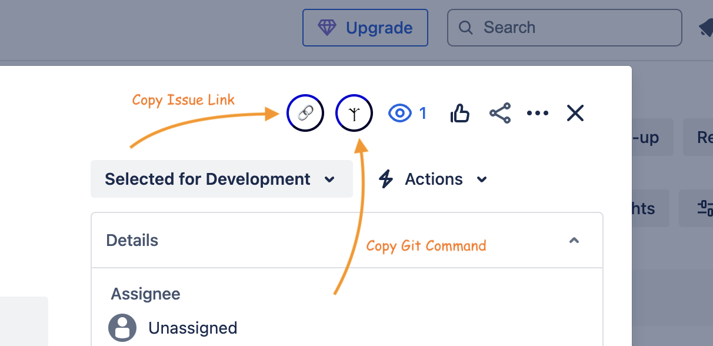

# Karabin Jira Utils

Adds two buttons to any Jira page that is displaying an issue, one that copies a formatted link to the issue and the other that copies a git command for creating a branch. The branch name will get the `bugfix/` folder prefix for bugs and `feature/` for other tickets (stories). Team designation prefixes (`[UI]` or `BE |` or `QA `) are stripped from branch names.

## Installation

1. Download the repo
2. In Chrome, go to Settings / [Extensions](chrome://extensions/)
3. Click _Load unpacked_
4. Select the folder where you downloaded it
5. Click Select, Load, or OK, depending on the browser UI
